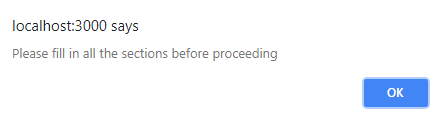

# Friend Finder App

**Live Demo** hosted on <a href="https://heroku.com/">Heroku</a>

### Objectives
1. Create an app that allows users to answer a variety of questions
2. Take the answers given and match them with all the current, previously submitted user questionnaires
3. Display a compatible friend to the user based on the answers they have given

### Installation
The user must first perform a <a href="https://help.github.com/articles/fetching-a-remote/#clone">git clone pull</a> and have node installed on their machine.
After everything has been cloned and the user nagivates to where the app is located locally, the following command must be typed into the terminal:
```
npm install

```
This will install all the required dependencies needed to run the application.
Once that is completed, the user can connect to the app with the command:
```
node server.js

```
At that time, the server will be up and running and can be viewed locally at: 
```
http://localhost:3000/

```

The user must submit a response for every question. If they do not, they will be unable to finish the survey.
</br>
</br>


### Resources used

*  <a href="https://nodejs.org/en/">Node.js</a>
*  <a href="https://expressjs.com/">Express.js</a>
*  <a href="https://www.npmjs.com/package/path">Path Module</a>
*  <a href="https://www.npmjs.com/package/body-parser">Body Parser Module</a>
*  <a href="https://jquery.com/">jQuery</a> 
*  <a href="https://getbootstrap.com/">Bootstrap</a> 